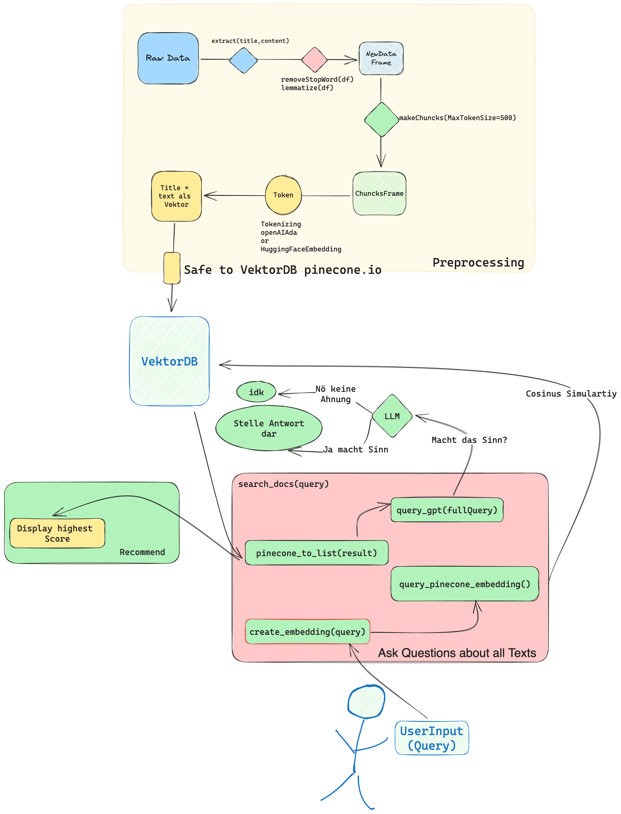

# RecommanderPythonGPT for NewsData

## Data
https://components.one/datasets/all-the-news-articles-dataset

## Funktionen

- Suche Allgemein Nach Artikel
- Random Artikel
- Anzahl der angezeigten Artikel definieren
- Art der Suche (content oder Titel based)

- Artikel Recommender (auf Random und gesuchten)
- Artikel selektierbar (auch session erhaltent, also mann quasi articel zwischen speichern)
- Auf den selektierbaren Artikels kann man ein Multi Recommander machen 

- Man kann auf jedem Artikel allgemein Fragen stellen
- Man kann über die gesamte DB fragenstellen
- Multi Level Recommender ist nicht eingebaut, weil es zu schwerfällig mit Streamlit ist (todo)

## Beschreibung des Tools

Die `LangChainHugging.ipynb` ist für das Erstellen der Pinecone.db zuständig, während in der `streamlit.py` die Oberfläche mit Suchlogic implementiert ist.

Um das Tool zu verwenden, muss man eine `.env` Datei erstellen, die auf der `default.env` basiert, und die entsprechenden API keys einfügen.

## Funktionsweise

